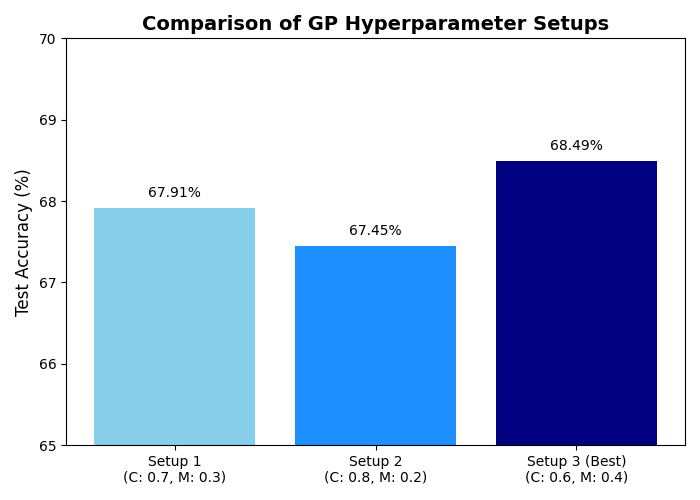
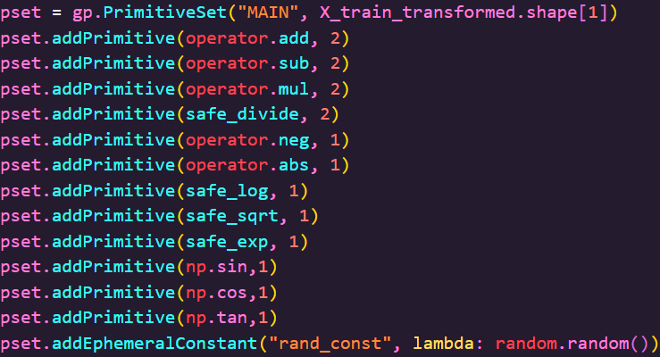

# 🧬 Diabetes Prediction using Genetic Programming (GP)

**CS6271 - Evolutionary Algorithms and Humanoid Robotics 2024**

This project explores the use of **Genetic Programming (GP)**, a type of evolutionary algorithm, to develop a predictive model for diabetes. The model is evolved to discover complex, non-linear patterns in health-related data, aiming to classify individuals based on their risk of diabetes.

---

## 🚀 Project Highlights

-   🧠 Developed a symbolic classifier from scratch using **Genetic Programming**.
-   📈 **Achieved a test accuracy of 68.49%** on the Kaggle competition dataset.
-   ⚙️ Implemented a robust **feature engineering pipeline** using correlation analysis and mutual information to select the most predictive features.
-   🧪 Systematically experimented with GP parameters, tuning **crossover and mutation probabilities** to find the optimal balance for model evolution.
-   A **video presentation** explaining the project's methodology and findings is also available.

---

## 🛠️ Technologies Used

| Tool/Library | Purpose |
| :--- | :--- |
| **DEAP** | Core library for building the Genetic Programming framework. |
| **Pandas** | Data manipulation, feature loading, and CSV I/O. |
| **NumPy** | High-performance numerical computations. |
| **Matplotlib**| Creating data visualizations to compare results. |
| **Scikit-learn** | Data preprocessing (`StandardScaler`) and model evaluation. |
| **Jupyter Notebook** | Interactive development, experimentation, and documentation. |

---

## 📊 Results Summary

The model's performance was evaluated based on test accuracy. Different hyperparameter setups for crossover and mutation probabilities were tested to find the best-performing model. The best results were achieved with a balanced probability set that encouraged both exploration and exploitation during evolution.

| Crossover Probability | Mutation Probability | Test Accuracy (Kaggle) |
| :-------------------- | :------------------- | :--------------------- |
| 0.7 | 0.3 | 67.91% |
| 0.8 | 0.2 | 67.45% |
| **0.6** | **0.4** | **68.49% (Best)** |

---

## 📉 Visual Insights

### Performance Comparison
This chart visually compares the final test accuracy of the three different hyperparameter setups that were tested.



### Genetic Programming Toolbox Setup
This code block shows the setup for the evolutionary engine using the DEAP library. It defines the mathematical primitives (add, sub, mul) the GP can use and registers the core evolutionary operators—crossover, mutation, and selection—that guide the search for a solution.




---

## 🔧 Getting Started

To run this project, you can clone the repository and run the Jupyter Notebook.

```bash
# 1. Clone the repository
git clone https://github.com/BlachThunder6302/Diabetes-Prediction-using-Genetic-Programming.git

# 2. Install the required dependencies from requirements.txt
pip install -r requirements.txt

# 3. Launch the Jupyter Notebook
jupyter notebook Diabetes_Prediction_GP.ipynb
```

---

## 📄 License

This project is licensed under the MIT License. See the `LICENSE` file for details.
